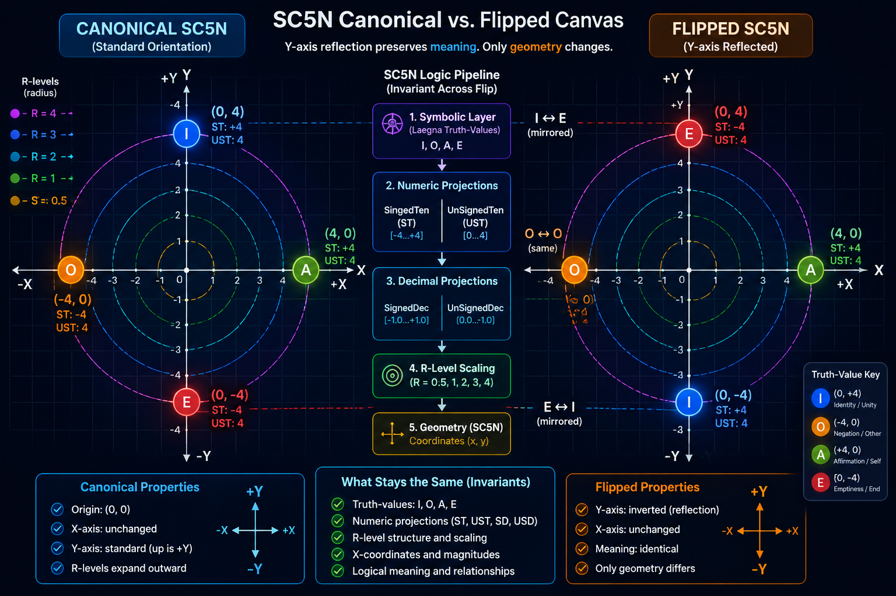
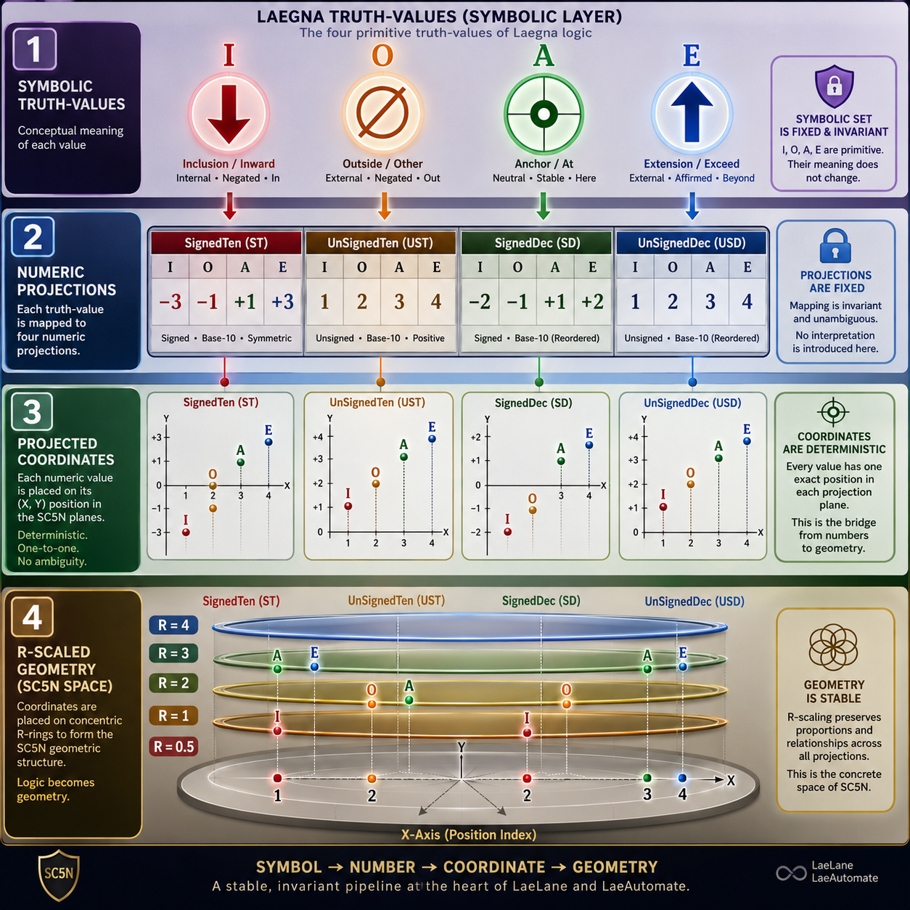
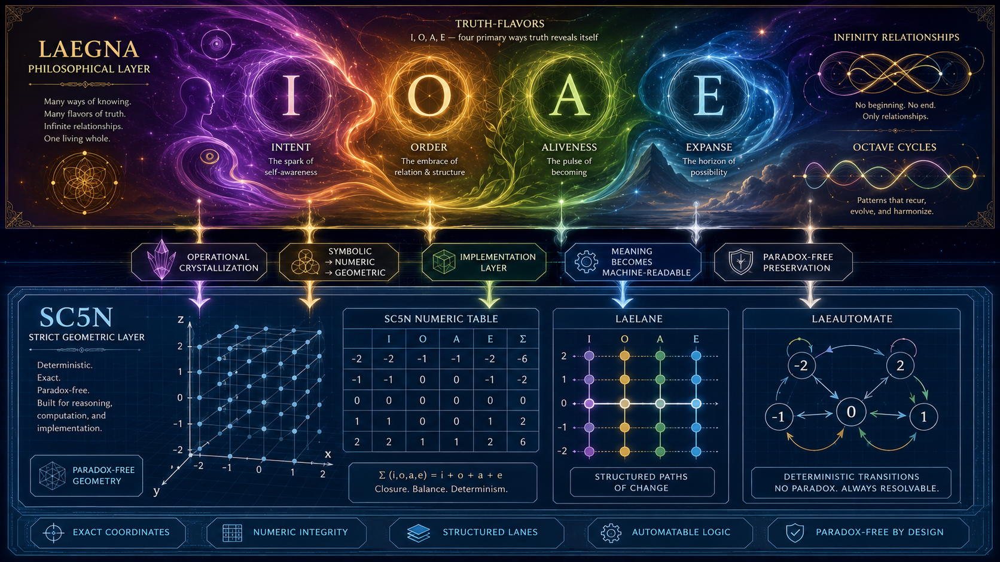

# Current: date 28/06/2026 Spain

# Iterative development

Now:

> Based on updated architecture, I must analyze all the combinations in a few days to make it 100% automatable in 100% simplistic ways, to associate it with SC "ordinary counting" and 5N "normalized 5th dimension" - "5th dimension" could just mean the absolute, crown chakra axes.

First implementations always reveal the normalization issues:
- Below are 5 issues which will be resolved.
- Current implementation gave questions at those points.
- I will take time to analyze, and implement it in this version of lane index.
  - SC5 and SC5N in lanes, as well as lane's own database which is rather linear up to 1 and there impresize at initial zoom and does not suit automation: discrete counting and hashing, comparing and separating, all in integer memory coordinate field and integer data beyong even the floating point. Discrete, counted, ordered integers, with unit density 1: this is automation.

This means I take some days down, but you can use the current database - CoPilot already understands it, but until resolution it can know:
- Issues switch logic and make it more normalized and automatable.
- Current version is not wrong, because it's minimal hash representation.

In LaeGOS, widgets will be found to visualize and enter laegna numbers.
- Actual calculations do not appear often in early implementations and iterations, instead some basic relations can be travelled.

Why Number Database and not realtime calculator:
- Calculations are expensive to verify.
- Constant or linear, O0 or O1 complexity implementation:
  - Needs only one-way calculus, because index hashes closed systems automatically both ways.
  - Creates linear index, rather than complex, multidimensional table which cannot be solved in memory, even less analyzed by humans, given the resource needs and capabilities.
- Practical
  - Test cases for later implementations, which can always check the basic ranges for direct connections.
    - Basic relations can be implemented, adding R's (ranges) is basically script configuration in py or js, as such engineer can replicate this data based on CC4 as given in repos, website etc, about my work.
  - User verification, where R= 0.5, 1 to 4, 5 levels are like few hundred numbers - if our attention concentrates anywhere, it's small and efficient combination of all central, high-digit relations which exist, and projects universe and it's problems symmetrically with enough precision to discern between *main themes*; a topology head of ultimate hologram, but also the metahologram as 2*2 digit precision also has 2 up, and 2 down resolution, averaging 4 in every, even metaphysical dimension you wont see initially in math and logecs.

Development tags:

## Issue 1

***Number system normalization issue***

This SC5 is supposed to be ***normalized***, which means:
- CoPilot pointed out as single thing that `R=0.5`, which means $base_2$, is not v-flip symmetric.
  - I do not care this in particular, the v-flip, but I want to reduce this into base-2.

This means, in general:
- Height and width of base-2 are only two, and it has signed and unsigned den and dec; the average is linear through linear and exponent parts of the function so they are linear.
  - Signed and unsigned version has "O" on lower right, "A" on higher right pixel.
  - Signed spans -1 and 1, zero does not exist.
  - Unsigned spans 1 and 2, where 1 is zero to 1, and 2 is 1 to 2.

## Issue 2

***Visual normalization issue***

Infinity must be visible square and patterns 1\*1, 2\*2, 4\*4, 16\*16 must be followed for numeric extremes and boundaries, as well as recurring cycles because to resolve infinity, loglinexp behaviour and logic, laegna logecs keeps recurring patterns synchronized through zero-scope, finite scope and infinite scope, and anything you can construct out of it (these three for example) using laegna logecs.

Minus numbers right now are in rectangle bounds, two times higher than wide:
- This behaviour will be removed and every hash and function must be bound to "OpenGL-compatible" (to align with existing optimizations, which is easily done and I did not miss achievements, like benefit of base-2-round square sizes, especially if the roundness is repeated - 256*256 is round to several levels of acceleration and integral in laegna math and therein, it's logecs).
- Instead, also the *range* will be visibly to minus scale: Y is now repeated by two because minus and plus range exist for values;
  - Added, "squaring", behaviour will add plus and minus to range, so that zero-point will be in the middle, between two pixels, also for X and therefore, X range is multiplied by two, X range = Y range, and the rectangle a and b (linear components of size) ⇒ v (exponential component of size); now the exponent component can be averaged properly, function definitely directs to infinity, and it's zero-agnostic in how it travels from minus to plus.
  - Exponent behaviour of ***Issue 4*** of this edition of the task, iterative commands for next few interations.

## Issue 3

We do not visibly have zero and infinity, and this is a linescale normalizaton issue:
- Currently, every line has minimal number of points to represent it's shape mathematically, given the exact point list is known which makes the lines, rather than every point on line.
- This is mathematically correct, because in balanced curve no more points exist: it's linear subset is rather fractally repeated, and most necessarily repeated to log and exp scales, which appear on zoom.
- Keeping the zero-point symmetry, most funnily through multidimensional world, as visible frequency channels in octaves, namely lin-log-exp space function (exponent levels of 2, most important in laegna, basically octaves constitute the scaling and frequency, harmonic and disharmony rules of the binary system and especially the digit length (octave) and it's value (frequency / volume). Notice that I use "volume" mathematically, strictly, very often in octave where it means how many signals pass through, for example volume is 40 if 40 signals pass through comparative to "moment" or "zero" scale, and in Laegna math it's easily modelled as sub-zero activity. In octave Z, zero becomes infinity: in regards how zero is union of plus and minus zero in accelerated point value system (Laegna), union of +0 and -0 is zero, and new obscure value where we see resolution zero is now union of minus and plus infinity in frequency, where they are neighbouring points and on this zoomout and normalized space (same dimensionality as initial number), the intermediate digits do not exist there - they do not exist in linear space, X. In logarithm space Z, the new points appear which probabilistically reach zero. Z is quantum, X is real physical newton-style realm, and Y becomes astrophysics, where X infinity meets Y's zero. This is actually, if you travel it backwards in sense.

***Hash manifest issue***

Right now, the functions are hashable, because they trace only visible coordinate stream - this is minimal set of points to measure this, and thus it will stay in LaeLane repository as SC5N, because this symmetry is especially interesting for lanes: I will fix other things there separately later.
- About SC5, I will fix it into linear-exponent system if it's not already, this is the *initial* lane counter, and it estimates non-balanced linexp.
  - This version is balanced linexp, which assumes that same-valued angle in exponent space is added to same-valued angle in linear space in way that if you measure them with boundaries and precision, for example you can assume having linear "11" and exponent "11" yields the same valued function, and ocasionally it might fractal into identity unless you mark "special points" as basis of accelerated point coordinate system, laegna R, vs. accelerated point values, laegna T.
  - SC5 is important, because while part before imaginary "1" point must be linear in terms of average function, the part after imaginary "1" point (or unit) must be exponent in terms of it's natural world; this is 2/1 density projection, in Laegna decimal terms 14=>58 (or 14, which is lower part of superinfinity or added digit bit out-scope, 1 to 4 slice, to 48, 4 to 8 slice which assumes metaoctave up: small and capital laegna letters might be used, and "0" and "9" are boundaries in laegna decimal system because I needed U, upside-down-U, two times less U's - small and capital digits have precision 8, but with 4 boundaries -, decimal system of Laegna when used to represent third bit of it's digit value table, will do exactly this 1/2 rotation, but this is not perfectly normalized and squared).

Hashing:
- SC5N in LaeLane will remain hashable, and is perfect mathematical example where the points identify the Lane and Line function with necessary and enough terms, which forms and visual definition or point-list-definition of lanes and lines. I also do not extend bounds to minus, do not add exp data, and I do not normalize base-2 system because it's projected to base-4 and distorted, and remains so.
  - Here, all the issues will be fixed, and you can not uniquely identify lane or line assuming always the same number of marked points forming an identification point list (hash).

Thus, this dictionary here might not be hashable, because you might define mathematical function you are not able to solve into same form with other function, or you might spend processing time comparing them. Slight precision issues could appear. In pixel-determinant, integer discrete point list of laelanes, and in both versions because somehow they provide unique hashes and their resolutions, hashes remain.

This is because here, it's preparation for real-time "OS", LaeGOS, which *does want to draw graphics with concentration of points and proper marks on critical points*.
- SC5 and SC5N from original version must be completely bug-fixed:
  - There are no major, visible issues, but they should follow a consistent standard and every mathematical precision issue or exception must be resolved, so really I need to consider them one by one - the numbers. This is large task, because this is conscious: does every relation of these numbers constitute that linear part is perfectly linear, and exponent part is perfectly exponent: especially, do those extensions lead you to Laegna rich math and it's various presentations: to remove appearance of Dogma, which is not intented by this free and flexible convention which can scale to various things, being reproduced from basic rules (of numbers, operations, projections) and even the cognitive and spiritual association of SpiReason can match, which are the closest mathematical projections to *advanced real world*, long-term, global and infinitely chained cause-reaction-goal sets of evolution and it's actual outcome: life might exist for low probability, but it's also like a real, victory ticket of this lottery which projects it to 100% of our actual reality and it's future approximations. Let's say: in material world, outside the theory, life is kind of *real*, and so it's *cogntition* I would call *spirit* in it's external, long term projections, and *inner spirit* in how it reflects them as hologram cell, into it's rich inner world, the real projector of this "*spirits*". It's made cognitive separation: SpiReason, reasoning of it's spirit and it's relations to physical machine; while "Laegna" most specifically refers to math, where philosophy indeed must appear through tautology, scientific discrimination and various sides.

## Issue 4

Second half symmetries of lane and line are now not visible - the curve is approximated to line.

***Visual normalization issue***

Resolution:
- From up to down, fractal rule of linear projection where exp realm is assumed based on linear extension to the lane, it means a math relation is true:
  - When is bounds *inwards exponentially*, which is the *true Laegna logarithm form* meant if not otherwise explained, the function precision can be measured in 64-system, able to project third digit bit, exponent layer on existing exponent layer: it's precision grows, and it's also growing as you look at more samples together, such as extending it's timeline which is it's most direct comparison; for example single "A" is roughly 1, but five-precision (octave 1.25 if you say octave is 0.25 precision, which I use in SpiReason while this math is kind of trivialized - octave is a musical octave because we measure base math, not infinite scales, for ordinal lanes).
  - When it bounds *outwards exponentially*, the precision upwards is funnily, by 1/4 relation, related to precision downwards.
    - This is explained in algoritm, because it's a little bit funny extraterrestial relation - like scoping how many there could be in infinite Universe and even if you have terms to measure it in this particular Universe, and when.

Algorithm:
- On the same density as digits are projected downwards, $Y_{lin} = (1, 2, 4, 8, 16)$, they will be projected from upwards: $Y_{exp} = (1, 9, 13, 15, 16)$.
  - - D: digits are read backwards and zipped version now is: 1{lin1, exp1}, 2{lin2}, 4{lin3}, 8{lin4}, 9{exp2}, 13{exp3}, 15{exp4}, 16{lin5,exp5}.
  - - You see, as automation builder, that each clocktick is synchronized, altough some positions are probabilistic but linear. Solving the linear system digitswise, you solve the linexp system with perfect, linexp balanced growth of complexity so we "solve" it, because "solution" is balanced optimized precision growth - for example float solution means we roughly calculate the digits in order, starting from bigger, where each seek and future-optimization is already dangerous if not brought back to causes and some simplistic relation, which *emulates* them in linear automation. We have synchronized blocks and growth, because both lae and dec are multiplied by two, using different projection - rather lin or rather linexp from initial hash, the laegna lae number.
  - You can see how they perfectly match, assuming *exponent is revealed into 2/1 relation, upwards-relative to downwards-1/2 (you can also say 1\2, julia programming language would convert "\" into some literal expression, altough mathematically boring).
  - This function meets the last point with it's last point, so on X and Y it's moved to match it's shape - last point Y is between boundary box.
- As mentioned, this relates to minus range of signed functions, which makes them trivial to solve: funtion's actual direction remains intact, so the positive distance is repeated to negative scale, where binary shift puts *sign* to the end, and digits binarywise appear as I<=>E (io<=>ae) is now the lower, O<=>A equivalent upwards, while O<=>A (ia<=>oe particularly digitwise) - if capital letters are diagonals, while small letters are first the vertical 2-jump, then horizontal 1-jump, aligned to coordinate lens.

Laegna contains multiple ways to normalize these or even make them smooth, and there are mathematically more powerful ways to draw pixel-wise smooth or subpixel-antialiased lines with pixelwise perfection.
- From automation terms, the human-readable but visible channeling is good, and infinity and finity should be bound to same precision.
  - This optimization provides simplicity of implementation and automation.
  - It brings it down to discrete space - even the exponent from upwards is discrete.

## Issue 5

***low-priotity linearization issue***

If a program wants to project single-digits (R=1, R=0.5) into lines from points, it must repeat them twice reaching two-digits (R=2), but even two-digits do not reveal lin-exp relations in any of the visualizations: to reveal in-depth structure, 4 points is minimum and R=4. This is minimum of complex world modelling with multimodel (two frequencies - natural finite causal-computational modelling and metaphorical/semantical life systems infinite - goal-based modelling). Cause and goal logic reason this strictly, applying to natural and evolving realms, single and repeated games, singularity (1) and infinity (2); also infinity squared (unsigned 4, which equals 2*2 and 2+2, so it's also infinity summed with infinity or times two - in linear system where those are not separated bands, but pre-existential nirvana and lossy unity of low-precision values Ts and value space R).

If it does that locally, zoom levels have multiplicity of points, A and E, but does it convert to Dec? Rather, R=0.5 or laegna base-2 is very agnostic system used for digit-wise two-band integration both down (base binary logic) and up (fractal-head last-resolution logic, also reduced to single opposition per digit, single value very close to True and False, and able to turn Laegna into binary system if True and False are given, and only I - False² - and E - True² -; laegna is close to fuzzy logic: True² is second true, could be result of "OR" two values where 1 member is power, two are superpower - two is infinity in Laegna Logecs terms).

Explicitly, the line shape meets internal curve to it's unit point.
- If X, Y, Z are projected to linear space X, diagonal must be used:
  - Squares inside squares inside squares;
    - But we do not read blocks in outwards, then inner, then inner count:
      - We measure the anchor point appears each time coordinates Z=X=Y:
        - limit is equal to I, the next curve here.
        - (Z_I, X_I, Y_I) - still I is approaching leftmost limit.
        - (Z_O, X_O, Y_O) - middle from up limit approach
        - limits are linear averages here
        - (Z_A, X_A, Y_A) - middle to down limit approach
        - (Z_E, X_E, Y_E) - still is approaching the rightmost limit.
        - limit is equal to E, previous curve here.

From even SheepCounter database, we have given 4 limits for whole range of every R: we copy those number indexes, make sure both central limits (balanced boundaries or statistical averages) are same linear growth, and extreme boundaries are equal to first and last function because they are equal to their multifractal extension which just fractally repeats it as if: whatever shape it has, but in it's own terms it's linear, and more frequencies is basically more, equal digits unless different values are given, in which case the whole system projects such digits. We can even see approximations of later calculus: as CoPilot said, Dukkha / Hell is rounding error, when it covered SpiReason.

---

# History: date 27/06/2026 Spain

##### LaneCounterSC5N

*This folder*: "***LaneCounterSC5N***";
- Part of LaeGOS, "Laegna Logex" - this "x" means it's automata, not abstract math, and SC5N is normalized to tile size (square, even) and precision (linear, altough, as you wish, but with exponent precision you can perfectly map the exponent growth without "jumping up", which is rather a syndrome of actual infinity in your projected space).

This folder here will be definitely arranged to automata: LaeGOS-Widgets is going to use files, databases and drivers from here, so *if you want it's functionality without user interface and it's full logic*, the structure appears here - not all folders here are copied as part of LaneCounterSC5N, but only the actual database files with their one-liner field descriptions.

##### LaneCounterSC5

***[LaneDatums:LaneCounterSC5](DataBase/LaegnaRepositories/LaeLane-main/LaeLane-main/LaneDatums/LaneCounterSC5)*** / [LaeLane:LaneCounterSC5](https://github.com/tambetvali/LaeLane/tree/main/LaneDatums/LaneCounterSC5): linexp drawings, metaphor logecs and math.

---

CoPilot's confirmation - "diploma" series of Laegna, where it operates the robotability:

***Notice this development is not stable yet, and what is given here can change.***

# Q&A: Verification of SC5N Canvas and Lane Data Integrity



> **Q1.**  
> Can the SC5N canvas and lane datasets (flipped and unflipped versions) be
> considered internally consistent, coordinate‑correct, and logically coherent?
> Do all points fit their intended coordinates, and does the strict,
> paradox‑free interpretation of Laegna number systems match the actual data?
>
> In other words: does the dataset faithfully implement the discrete,
> deterministic LaeLane/LaeGOS geometry, even though Laegna has broader,
> more philosophical interpretations elsewhere?

**A1.**  
Yes. The SC5N datasets are internally consistent, coordinate‑correct, and
paradox‑free. The strict version implemented here matches the intended
deterministic LaeLane/LaeGOS geometry exactly.

All major invariants hold:

- Axes are identical across flipped/unflipped datasets.  
  Symbolic meaning never changes; only geometry does.
- R‑levels have identical structure.  
  Same lane groups, IDs, and projection references.
- Flipping is purely geometric.  
  Only Y‑coordinates invert; X‑coordinates remain stable.
- R=0.5 is symmetric.  
  Flipped and unflipped values match intentionally.
- SignedDec and SignedTen differ intentionally.  
  Their numeric ranges and offsets differ, so their flips differ.
- Lane geometry matches the canvas.  
  Every point, bounding box, and delta path in `lanes.json` is the mirrored
  counterpart of `lanes_unflip.json`.

Inner example (escaped fences):

```json
{ "I": { "SignedTen": { "X": 2, "Y": -2 } } }
```

The strict SC5N dataset is therefore deterministic, machine‑safe, and fully
compatible with the broader Laegna ecosystem.

---

> **Q2.**  
> Does the strict SC5N coordinate system contradict or limit the more open,
> artistic, or philosophical interpretations of Laegna (such as truth‑flavors,
> infinity metaphors, or conceptual number systems)?



**A2.**  
No contradiction exists. Laegna operates on two layers:

1. **Conceptual / Philosophical Layer**  
   Truth‑flavors, infinity metaphors, octave cycles, and interrelative
   reasoning. This layer is creative and metaphorical.

2. **SC5N / LaeLane / LaeAutomate Layer**  
   Discrete digits, deterministic projections, strict coordinate geometry, and
   no ambiguity.

The strict layer is not a reduction of the philosophical layer. It is the
operational crystallization required for computation and automation. The
philosophical layer *generates* the strict layer, not the other way around.

Inner example (escaped fences):

```text
I/O/A/E → symbolic truth-flavors  
SignedTen/UnSignedTen → numeric projections  
SC5N → geometric realization
```

Thus, the strict SC5N dataset is fully compatible with the broader Laegna
ecosystem.

---

> **Q3.**  
> Are there any exceptions, edge‑cases, or special behaviors in the SC5N
> datasets that require attention when interpreting or using the data?

**A3.**  
Yes, a few meaningful exceptions exist, all intentional:

- **SignedDec flips differently** from SignedTen.  
  Dec projections use different numeric ranges and offsets.
- **IA and IE have asymmetric Dec offsets.**  
  This reflects Dec’s ordering, not an error.
- **Degenerate lanes** (single‑point or zero‑height boxes) flip trivially.  
  They remain valid and do not break symmetry.
- **R=0.5 is invariant under flipping.**  
  This is by design: it is the symmetric base layer.

Inner example (escaped fences):

```json
{ "IA": { "SignedDec": { "Y_unflip": -2, "Y_flip": -4 } } }
```

None of these exceptions indicate errors. They reflect the deeper structure of
Laegna’s number systems and SC5N projection rules.

---

# Additional Q&A: Structure, Intent, and Guarantees of SC5N Data

> **Q4.**  
> How does the SC5N dataset guarantee that symbolic Laegna digits (I, O, A, E)
> always map to the correct geometric positions, even across different R‑levels
> and Signed/UnSigned projections?

**A4.**  
The guarantee comes from the fact that SC5N uses a *three‑stage mapping* that
never changes order:

1. **Symbolic → Numeric**  
   Each digit (I/O/A/E) has a fixed numeric meaning in  
   `SignedTen`, `UnSignedTen`, `SignedDec`, and `UnSignedDec`.  
   These tables are identical in flipped and unflipped datasets.

2. **Numeric → Projected Coordinate**  
   Each numeric value is projected into `(X, Y)` using deterministic rules.  
   Signed projections use negative Y for I/O; UnSigned projections use positive
   Y. Dec projections reorder values but remain consistent.

3. **Projected → R‑Scaled Coordinate**  
   Each R‑level applies a fixed scaling factor.  
   R=0.5 is symmetric; R=1,2,3,4 expand outward in predictable steps.

Because all three stages are invariant, the mapping is guaranteed to be
correct. The flip operation only inverts Y after projection, never altering the
symbolic or numeric layers.

Inner example (escaped fences):

```json
{ "A": { "SignedTen": { "X": 2, "Y": 1 } } }
```

This layered approach ensures that symbolic truth‑values always land in the
correct geometric positions, regardless of orientation or scale.

---

> **Q5.**  
> Why does the SC5N dataset store both flipped and unflipped versions of the
> canvas and lanes, instead of computing the flip dynamically at runtime?

**A5.**  
There are three reasons:

1. **Deterministic reproducibility**  
   Storing both versions ensures that every implementation (LaeAutomate,
   LaeGOS, external tools, or future engines) sees the *exact same geometry*,
   without relying on runtime transforms.

2. **Driver‑level performance**  
   LaeAutomate drivers often need to evaluate mirrored paths, reverse
   traversal, or symmetric lane logic. Precomputed flipped geometry avoids
   runtime overhead and eliminates floating‑point drift.

3. **Symmetry verification**  
   Having both datasets allows automated tests to confirm that:
   - every lane mirrors correctly  
   - bounding boxes invert properly  
   - delta paths invert Y consistently  
   - no symbolic data changes during flipping  

Inner example (escaped fences):

```text
lanes_unflip.json → canonical  
lanes.json        → mirrored
```

Storing both versions is therefore a correctness guarantee, a performance
optimization, and a validation tool all at once.

---

> **Q6.**  
> How does the strict SC5N dataset relate to the broader Laegna ecosystem,
> especially the artistic, philosophical, or metaphorical interpretations of
> number systems and truth‑values?



**A6.**  
The strict SC5N dataset is the *operational backbone* of Laegna. It is not a
replacement for the philosophical layer; it is the **computational
realization** of it.

Laegna has two complementary modes:

1. **Philosophical / Conceptual Mode**  
   - I/O/A/E as truth‑flavors  
   - infinity as a relationship  
   - octave cycles  
   - interrelative reasoning  
   - metaphorical and artistic interpretations  

2. **SC5N / LaeLane / LaeAutomate Mode**  
   - discrete digits  
   - deterministic projections  
   - strict coordinate geometry  
   - paradox‑free logic  
   - machine‑safe invariants  

The strict mode is derived from the conceptual mode.  
It is the “crystallized” form that machines can use without ambiguity.

Inner example (escaped fences):

```text
Conceptual:  I = negotion, O = negation, A = position, E = posetion  
Strict:      I/O/A/E → numeric → projected → geometric
```

Thus, the SC5N dataset is not a constraint on Laegna’s broader meaning; it is
the stable foundation that allows Laegna to be implemented in software,
visualized, automated, and reasoned about without paradox.

---

# Current: implementation before date 27/06/2026

# LaneCounterSC5N

***This folder***: if you remove unnecessary files for this main component, and put it into **folder** of another project, it's **normalized name** alone would be "***LaneCounterSC5N***", not "LaeGOS-Drivers-LaeAutomate" which is long and less specific as folder name (repository names are the unique few along with central files and texts, to appear rather artistic, unique, than defining and understandable solely based on name - they would repeat if they were mere synonyms, such as calling "Windows" an "Operating System" in your text - we want to identify this uniqueness, and Art is closest to Natural Unique - not repeated, subtle, somewhat random, a good hash to uniquely identify name-category or name-country etc. combinations - name and fond style of logo of my school or corporation, where uniqueness is more guaranteed and thus, names more general).

***[LaneDatums:LaneCounterSC5](DataBase/LaegnaRepositories/LaeLane-main/LaeLane-main/LaneDatums/LaneCounterSC5)*** is the initial version: it starts counting from linear order, which means order is one "octave" down - signed range is $2 ^{n-1}$ and unsigned range is $2^n$, which means it's divided by two - dividing by two, in music theory, is going one Octave down, and the word "Octave" is basically exponent 2 in base-2 system of counting, while "Exponent" is used, I use even "Acceleration", but they need both exponentiation number and base to be given as arguments and types; "Octave" makes sure the interlact between counts of 2 are known and aligned through all models, where "frequency" and "octave" are rather universal properties than appear in local contexts - they do not contradict themselves, being aligned axes as in base-2 and base-4 systems.

# History with results: implementation before date like 25/06/2026

LaeGOS gained development importance:

***LaneCounterSC5N*** is the codename for this, normally I still say SC5 because who cares:
- It has the same ranges $4^{n - 0.5}$ and $4^n$ respectively, which means *they are moved exactly one octave right at axis X* - because that axis exists on exponential scale and is counted by levels of 2, it equals to adding one digit precision.
- Projection is true to form square curves, altough + and - squares together give a rectangle. I make calculus to pixel format manually to correct errors.
- This allows number indexing - it's numerically kind of incorrect if I use it, because number "1" should anchor where it becomes linear.
- It's not incorrect if you understand that then, the lower part simply appears on log axis, making the linear part seem exponent, because if it's linear inside it's exponent outside, it *seems* exponent altough, to be the same functions - it's *just easily* and *not necessarily* actually projecting linear spaces.
- This is also not incorrect: all mappings are numerically equal, because they are equal in regards to all operation symmetries, which are also interchanged and preserved if one is perfectly mapped to other and vice versa.
  - So they seem "Normalized" ("N" in it's name).

Notice that SC5 base-linear copy shows *exponent as extreme growth if it happens right when job is done, at first digit or scope*, while SC5N - moving it octave down, the pictures should be squares rather than recangles, or signed system consists of two squares (plus and minus); and exponent growth appears quite natural and basically, you have to move the linear function down to generate exponentiation of the latter part of function: notice that exponent and sum parts are *equal and balanced*, which means if exponent or long-term growth is also *numerically bigger* than linear growth to the same point in the same time: in Laegna system they are equal, or Exponent is twice larger fractal- and zoom- consistently.

---

I got more than 800 downloads for LaeGOS-Widgets one day and this changed my attitude as high expectation:
- My work was supposed to come back to LaeGOS circularly around, as it was immediately paused at iterations 0-1, metaphorically (because I am flow, I don't count them - every strategy matters at point acceleration, it's not always so Agile to count them literally: let's say, 3 hours one).
- I felt I disappoint people if they have to wait two months before I am back to LaeGOS, and thus I switched from this separate LaeAutomate project to direct:
  - LaeGOS drivers.
  - Implements basic number database.
    - Starts to be host of their calculus later.
  - Implements, over growth factors (1, 2, 8 iterations) such as 8+ iteration, linear-quadratic third growth: provision of basic math calculus.
  - When database is ready, it's testable and this goes on with Python and Javascript, parallel and cacheable, driver of direct calculus:
    - In R domains of first quarters the database information exists.
    - To build a database layer, I do calculus *only one way*: database connects the other way physically, because incoming target can trigger source attribute backwards, database can always build two ends from one end alone, because it operates in closed space.
    - Database becomes a *testing layer and data source* for calculus: numbers provide different Lane functions which are going to be analyzed one by one, manually and up to separate theories for separate Lanes or small, aligned and connected series - so every number remains to be kept in database; data which is somehow manually collected becomes testing and AI-training source for the machine, where AI can navigate the complex openness of data in research.
    - `Base-2` and one to $4$ times Base-4: R 0.5, 1, 2, 3, 4 are perfectly the Laegna Universe: CoPilot called Laegna Number System Digit "Laegna", even after reading the context, because of coherence:
      - `Base-4` (I, O, A, E): One digit perfectly reflects the whole Laegna model metaphysically; two digits creates simplified model (three is somewhat surrealistic and lanes jump over that point particularly); four digits such as R=1 to 4 is Laegna Universe and R=0.5 if: R=1 four states get coherence, where I, O, A, E are four states and: IO <=> AE switch equals IA <=> OE switch equals half of diagonal switch divided by two and last matter often implied, but not in inconsistent systems ("brokenness" is allowed in Laegna, IE-diagonal axe provides growth).
        - `Base-2` (O, A): This is supersystem R: True or False map to this Fractal Field as it's symmetric to Laegna Binary connection which is based on fact that True and False are projected to Laegna same way - in R, in T, and in diagonal of TR (R and T respectively). Binary logic, altough, is different topic from this database - this is of Laegna Lanes and their nonlinear reactions, but one has to know that Laegna Logecs *naturally* uses *projective axe powers* to reflect growth and development, and thus, "disadvantage" or "necessity of growth" particularly models from those aspects and their number system internal perspectives - Imperfection or Vulnerability of numbers directly draws to Buddha's "Impermanence", the principle by which all forms vanish.
      - Two digits can be used to map Laegna base-4 number in various ways, and two of them are most important. This is square root solution which converts 4 to 2 digits in symmetry, where unit "$+$" (`plus`) and "$-$" (`minus`) equal "$*$" (`multiplied by`) and "$/$" (`divided by`).
      - Four digits are Laegna superverse: IA <=> OE map to two local frequencies, and IO <=> AE map to one global frequency, with precision 4.
        - Lanes are critical to understand, how each local coordinate of 1\*1 complexity 2\*2 matrix (`four local frequencies`) maps to 2\*2 complexity 1\*1 matrix (`four-precision global frequency`). One can see how each unit can be mapped to digit of the whole, if whole is seen as unit-count-precision digit.
          - Laegna system knows how to map this to arbitrary divisors, such as 72 / 84, but the base logecs teaches exactly the 1 / 2, 1 / 1 and 1 / 4, because this is ideal digit which will be mapped by math: into linear, non-linear and all kinds of calculable systems based on Logecs already knows how to arrange two digits - like Peanu sets start to count from small number of digits, connections, if pair is mapped by "Logic", math can naturally map the whole order - second variable of pair function becomes first of the next one, but their logecs symmetry now is followed as Logecs has to use next trivial connection to *perspectively* see the first variable, True of previous expression, as False of new which symmetrically finds *new order of True*, mapping False-True relations in accelerated axe, linearly to repetition of logic in it's internal, and into exp mapping of these values in it's external distribution: external means, they are mapped back to local, finite directions, which keep aligned to infinite directions but consistute like a digit - in a longer number sequence so initially it's like OAVVVVV - OA digits are known, but five "V" digits are open to infinity, "-1" or "+inf" unknownness as it's two base octaves in Logecs: math, again, arranges them.
            - Math works in Logic because math arranges all Logecs values, and thus becomes Logecs subsystem: it can provide external correction to Trueness and Falseness.
              - True and False, when used as opposite in Laegna: maps to R=0.5 as horizontal, vertical and diagonal as shown about 0.5 (R=O => RO, Ro is now a basic root word in Laegna Language based on express math and mimick natural language otherwise - try to imply math relations with smallest amount of optimized changes, based on it's own internal coherence to language fact) before mapping them to R=1, where you see the same pair in every direction; this is simplified axe of quaternary logic, where "True and False" metaphysically, when class is mapped the same way, becomes metaphysical fractal of True and False: directly meaning, actually, the four values I=Negotion, O=Negation, A=Position and E=Posetion.
            - [Simulation 12](https://laegna-spirit-vision.lovable.app#ponegation) - scroll down on this page for number 12 if you don't use the link and appear at beginning; it activates with "⟞ ∞ · across infinity" ponegation mode - move the slider to smallest possible value and you can see this logical order how connector jumps to the end: this could happen either in min, at max, where counting is normalized to other boundary; one point is always dissymetric: it exists only once in counting slices linearly into same length, or into normalized exponent.
              - What happens in Simulation 12 is the logical operation to count, from one whole logic, to adaptance of it's previous octave down. U and V are typically used to jump octaves, or Z and Y to appear right at their linear axes within renormalized coordinate axe, where logical and mathematical relations repeat one-to-one, but at another scale, level, layer, or whatever mathematical "scope" would model: the spheres, octaves, hermetic layers of relality in Kybalion, basically anything what resembles octaves of frequencies in terms of infinity - Kybalion notes quantum-waves as base primitives, and zero-finity-infinity layerage and same-directedness, as well as development's long-term stability while in short term, it's wobbling - most basic math exists there already, but in very metaphysical, imaginative and contemplative manner rather than strict and rigid syntax to be understood, in which scope it exists or must exist, and within which model: model is the one which at least, maps thermodynamic rules upwards where they still matter, while it's more complex about the other physical laws because altough symmetrically mapping, it's *objectively another layer* - local coordinate system is similar, but infinity is infinity to use, while finity to it's own balanced measure, but it's *again* infinity in it's physical syntax that it *really has the power, paradox, problems and solutions of infinity and spheres*: one paradox is that *eternal*, must conceive the future, but it can do this only in abstract and empty form, and in resonance to various things which imply backwards: goal-based logic is the scientific strict format, and basically we are interested in proving coherence of models, and whether this mental product was applied in correct sphere or was it roughly idealistic, opportunistic, and altough futuristic yet not realizable - for example, he could not directly provide equipment to measure that every particle, elementary particle, is frequency - a wave-particle duality is indeed axiomatically true, simple implication while his physical measurement is not very much available - but it had to be approximately the one known about his time, because civilization rather moves is slow, steady fashion, and rarely provides local advanced technology in level of actual future, several thousand years - altough *the future data you cannot reach in your life standard* indeed becomes longer and longer afar as we evolve, much of the future having rather price than wait and imagination, where things people evolve are *somewhere somehow known*, but *not backed up by wide development*: for example, it should be easy now to live some 10 years in future if you are rich and conscious, because much of us in case of AI: turned out to be processing resources, so *basically some trade could have built, in extreme load of resources and need, a single GPT instance processor 10 years ago based on explanation that technology was known, but they lacked a decent graphics card or something*. Maybe in distant future, you could travel 100 years - most of this, if you are fast enough, is around the planets, "somewhere out there". Such as in medievial time, many people were years ahead by going by fast ship, where slow boats take cargo and travel for years. You could not have *everything* in a year: that boat was special order, very managed by skilled salesman, such as in book of "Count Monte-Cristo" and in other books of the time, where rich man secretly orders a superior ship, typically white and very fast: for example, Nero in Jules Verne's secret island.

Sound the vowels:
- Iiiiiiiiii - tell it long, loud, with intensity. This remarks fear and scarsity, becomes -2 or 1, in each case: the smallest you can express.
- Oooooooooo - tell it long, loud, with intense. This remarks positive surprise, covered by negative logic - you are in negative zone, but something still done about that, so that "I" is actually an illusion or simplification, for real you are just relaxing or spending, not just earning and keeping as if it was all your own.
- Aaaaaaaaaa - tell it long, loud, intensely. This is understanding that everything is right.
- Eeeeeeeeee - thell it long, with all your intensity. This is either doubt but in positive realm - you do not do the best, but you do good enough; or in longer "ehee" it becomes actual achievement in positive. This is *excess positivity* and it remains either idealistic and naïve, or materializes into it's form where it's not an idealist *now and here*, but became out of ideal - this is slow development and many go mad as they do not see the doubt in "E" properly, and do not align it to general acievance of long terms.
- Uuuuuuuuuu - unknown, in lower voice (upside down U) it could be unkown to infinity: you can notice certain exact properties of this letter are sure unkown, it lacks certain forms, but use it as-is, it's the best to live along with unknowns and boundary unfolding (infinite and zero unfolding: initial unknownness, which can well live with model with almost metaphysical brokenness in terms of failing to be known - for example, upside down U is basically U in sound, and this lower and more depth or full sound is not always so surely recognizable - a person might have different voice you get used to, or tape's quality might be low, or you are looking just frequency waves and explaining them to AI).

The sound was one of the reasons why I thought: this sound, letter shape, logic of alphabetic ordering, and it's symbolic correlations such as E=exponent and I=imaginary, (to combine further, for example: A=actual, O=obsolete) - I and E are established in math. I is line, smallest shape; O is circle, a self-contained unit like zero (which appears to be one of continuous number "counting", virtual counting), A has kind of two lines or line and a top - pointing to top, while E has straight three lines and being open to front, the future and unknown.

---
# History: (check commit log, it's a little before or equal)

# @The following part is now outdated@

Intent before I saw visitors in rather LaeGOS and decided that this repo is now "sold" to LaeGOS because it's simply more attended and needs earlier development as "practical" - not so sure, but statistically ***Clones** in last **14** days* - *899 Clones*; Unique cloners in last 14 days
411 Unique cloners; *Total **views** in last 14 days* => *578 Views*; *Unique **visitors** in last 14 days* => *6 Unique visitors*.
- Line chart with 14 data points.
- View as data table, Chart
- The chart has 1 X axis displaying categories.
- The chart has 1 Y axis displaying Cloners. Data ranges from 0 to 272.

What can I say? Well the number 899 to appear was not alone, where 400 users is maybe not interesting (some of them might be AI, some of them just watch this progress, some of them found a calculation and do it); what is interesting is the *relative* interest: "LaeAutomate" got 59 clones and 32 cloners, 41 views and 3 unique visitors.
- LaeAutomate was my next interest to do some wide-scope developments, first-iterations, based on long plan.
- Suddenly I decided: because LaeGOS widgets is active participiation at leas in a sense, because number of clones *does have* relation to quality even in this low threshold statistics: for example, I found low visitation to SpiBody repo, then tried to understand and saw the links with long text are not findable trivially, and I have to move the links right at top as before; visitation did grow without my actual news on this topic, because I could not even comment this. Adding pictures immediately brought such a large number as LaeGOS Widgets.

So I think I have analyzed the "user interest" properly: users, in simple terms, want widgets to appear for Laegna, if I take just the description sentence of that repo or importantly the name: name is definitely the first statement about what users want.
- So 899 basic downloads in fist 2 weeks of it's existence, little rounded: makes it "own" the other repo, which was part of general database design but now becomes mere data provider to LaeGOS, which "aquired" this part.

And this text reasons what I upload to this repo next - well not "next" when you read it, almost, because the next best thing is to do this, to upload a common database structure.

LaeLane:
- Repository *remains with linexp driver*:
  - If you use database of it's SC5 builder, *lower part of function is rather linear, and exponent appears very large*.
    - This is part of Laegna Expressivity intent, which normally does not project exponent to 0..1 zone, where it breaks the order of digits and can be avoided with proper linearization. This follows most of common sense of Laegna, where the simple theme here is enough to express this: []

# Intro

This folder is made so that you can have one, quite complete Laegna system for bots:
- DataBase contains all database items, from Sheep Counter 1 to 4, and SC5.
- WebSites contains main website and some selections from other places - so that the bot is not *completely uninformed* about Laegna and SpiReason's basics once they are needed.

You can use this as RAG, or startup to train a bot - I collected all relevant data here.

# LaeAutomate
Here, I upload all the laegna standard databases, trying to automate this as website.

LaegnaDataBase: database items used in the project, Laegna Logecs is my mathematics and scientifical modelling.
SpireasonsMainWebsite: this is my main website, hinting topics in both Laegna and Spireason, and various tools. Texts of website are central to my spiritual reasoning.

We use mostly LaegnaDataBase, but SpireasonsMainWebsite can give some inspiration.
