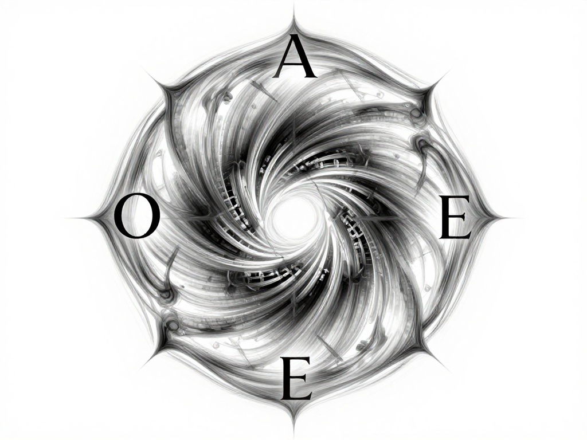
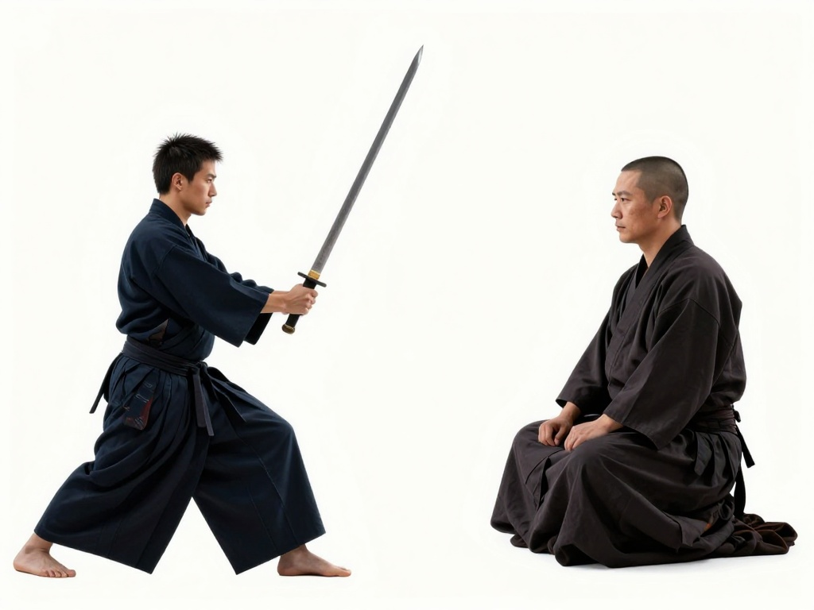
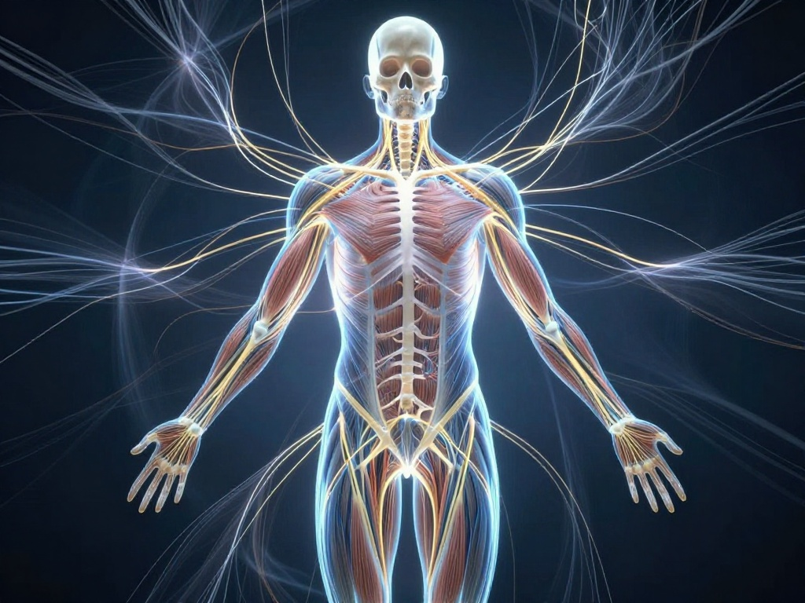
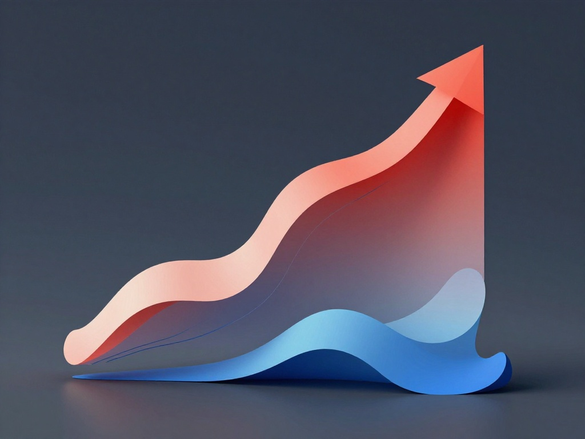
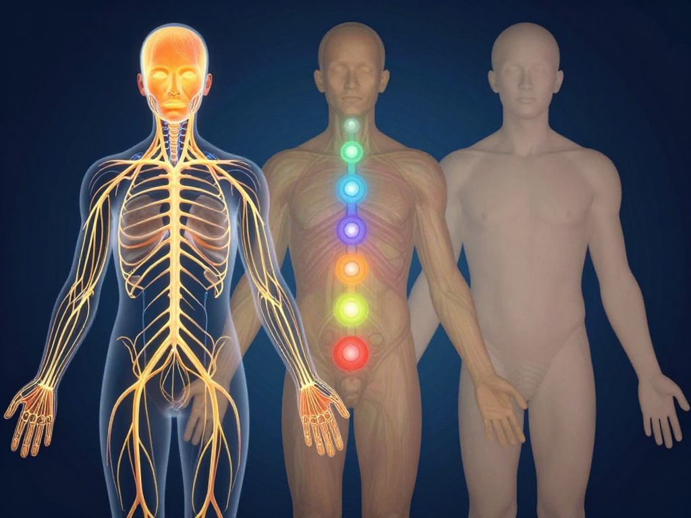
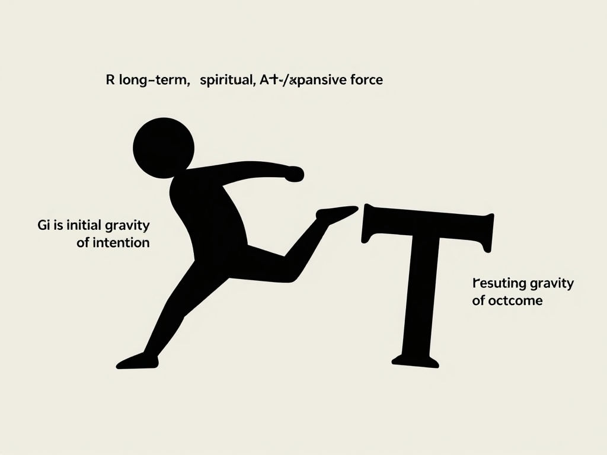
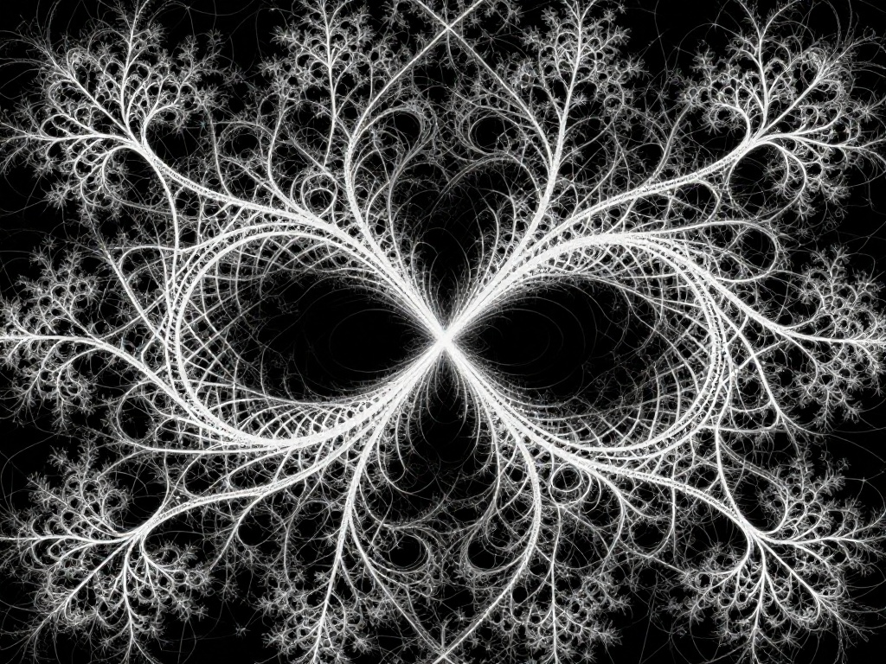
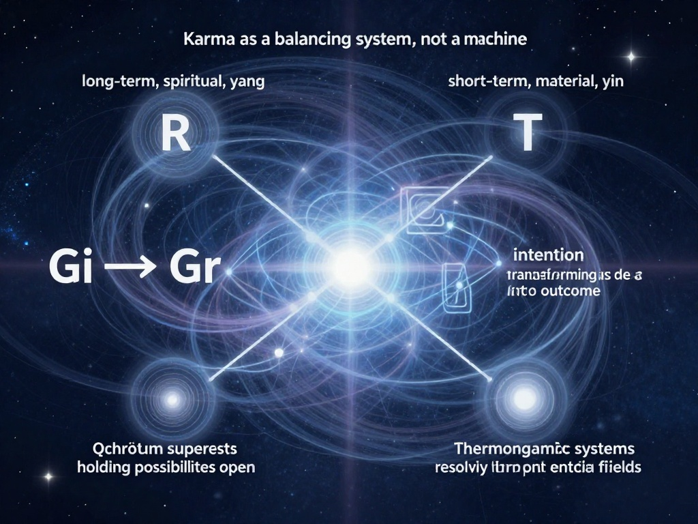

# Laegna of SpiZenTao

This text is written by AI to integrate:
- https://github.com/tambetvali/SpiZenTao/blob/main/README.md (ideas of this will be inherited and extended)
- https://github.com/tambetvali/SpiBody - facts about SpiBody and it's chapters are around this repo; READM.md contains the most introductionary part, which seems almost complete.
- https://github.com/tambetvali/LaeArve - here, Laegna math in general gets introduced.
- https://github.com/tambetvali/SimplyAboutInfinities - Infinity Science in Laegna are getting to go, reasoning Spirituality.
- https://laegna.notaku.site/ - Laegna manual at Notaku
- https://github.com/tambetvali/SpireasonWebsite17052026 (https://spireason.neocities.org/) - main site and it's code repo

All these sources will be used to research, whether topics of main text are extended.

# 🌿 Laegna of SpiZenTao  
*The Living Logic of Breath, Body, Infinity, and Meaning*

Laegna is the logic that breathes.  
SpiZenTao is the body that thinks.  
Spireason is the world that remembers.

Together they form a single organism:  
a living mathematics of being.

This text is not a manual.  
It is not a doctrine.  
It is not a system of rules.

It is a **map of movement**,  
a **geometry of awareness**,  
a **physics of meaning**,  
a **spiritual mechanics of the everyday**.

Laegna is not learned.  
Laegna is *recognized*.

---

## 🌬️ 1. The Fourfold Pulse  
### I — O — A — E  
Everything begins with the pulse.

Not the heartbeat.  
Not the breath.  
The deeper pulse beneath both.

The pulse of **I/O/A/E**.

- **I** — the inward collapse, the dissolving, the softening into depth  
- **O** — the boundary, the cut, the clarity that separates  
- **A** — the stance, the direction, the arrow of intention  
- **E** — the expansion, the radiance, the outward flowering  

These are not truth-values.  
They are **modes of existence**.

They appear in thought, emotion, movement, decision, creativity, silence.  
They appear in the body before they appear in the mind.  
They appear in the world before they appear in language.

Laegna simply writes down what reality is already doing.

### The Pulse Is Older Than Logic  
Before any philosophy, before any mathematics, before any system,  
the pulse was already there:

- the collapse before insight  
- the boundary before choice  
- the direction before action  
- the expansion after release  

Laegna does not invent this.  
Laegna **names** it.

---

## 🧘 2. SpiZenTao — The Body of Laegna  
SpiZenTao is the physical expression of the pulse.

It is the way the body organizes itself when it stops fighting its own structure.  
It is the way breath becomes geometry.  
It is the way movement becomes clarity.

### The Body Speaks Laegna  
Every inhale is **A**.  
Every exhale is **E**.  
Every stabilization is **I**.  
Every alignment is **O**.

SpiZenTao is Laegna without symbols.  
Laegna is SpiZenTao without muscles.

The two are mirrors.

### The Fourfold Body  
The body has four layers that correspond to the pulse:

- **I — Core**: the inward, the stabilizing, the deep center  
- **O — Frame**: the boundary, the structure, the skeletal clarity  
- **A — Vector**: the direction, the intention, the forward stance  
- **E — Field**: the expansion, the radiance, the energetic presence  

When these four align, the body becomes a single coherent instrument.  
When they fall apart, the body becomes noise.

SpiZenTao trains coherence.  
Laegna describes it.

---

## 🔥 3. The Spiral of Meaning  
Laegna does not move linearly.  
It spirals.

Every truth-value is a direction of transformation.  
Every number is a gesture.  
Every operation is a movement of awareness.

This is why Laegna feels alive:  
it does not describe the world —  
it **behaves like the world**.

### The Spiral Is the Shape of Understanding  
Understanding does not move in straight lines.  
It moves in spirals:

- collapse into confusion  
- boundary into clarity  
- direction into insight  
- expansion into mastery  

Then again.  
And again.  
And again.

Laegna is the mathematics of this spiral.  
SpiZenTao is the embodiment of this spiral.  
Spireason is the world built from this spiral.

---

## ♾️ 4. Infinity as a Daily Experience  
Infinity is not a number.  
Infinity is not a concept.  
Infinity is not a philosophical abstraction.

Infinity is the moment you realize:

> “I can go deeper than this.”

Infinity is the refusal to accept the first boundary as final.  
Infinity is the recognition that meaning does not end.  
Infinity is the courage to continue.

### Infinity Is a Cycle  
Laegna treats infinity as a cycle:

- **I** — collapse  
- **O** — boundary  
- **A** — direction  
- **E** — expansion  

repeat  
repeat  
repeat  

This is the same cycle your breath follows.  
The same cycle your thoughts follow.  
The same cycle your life follows.

Infinity is not far away.  
Infinity is **how you already function**.

---

## 🌌 5. Spireason — The World That Forms Around the Pulse  
When you start thinking in Laegna,  
the world reorganizes itself.

Not magically.  
Not mystically.  
But structurally.

You begin to see:

- where things collapse (I)  
- where things cut (O)  
- where things move (A)  
- where things grow (E)  

You begin to see the architecture of meaning.  
You begin to see the geometry of intention.  
You begin to see the physics of your own mind.

Spireason expresses this visually:  
the world as a living logic,  
the logic as a living world.

### The World Is Not Static  
Spireason shows that the world is not a fixed object.  
It is a **dynamic field of transformations**.

Everything is in motion.  
Everything is in relation.  
Everything is in pulse.

Laegna is the grammar of this world.  
SpiZenTao is the way to move inside it.

---

## 🧩 6. Laegna Numbers as States of Being  
A Laegna “number” is not a quantity.  
It is a **state**.

`A` is not “1”.  
`A` is the feeling of taking a step forward.

`E` is not “2”.  
`E` is the feeling of opening your chest and letting the world in.

`OI` is not “minus something”.  
`OI` is the feeling of drawing a boundary and then sinking into yourself.

`AEI` is not “a composite value”.  
`AEI` is the feeling of moving forward, expanding, and then collapsing into clarity.

Laegna numbers are **emotional geometries**.  
They are **cognitive postures**.  
They are **spiritual mechanics**.

You don’t calculate them.  
You **recognize** them.

### Numbers as Gestures  
A Laegna number is a gesture of consciousness:

- a tilt  
- a shift  
- a contraction  
- a release  
- a direction  
- a radiance  

Numbers are not symbols.  
Numbers are **movements**.

---

## 🌱 7. The Living Logic  
Laegna is not a theory.  
Laegna is not a belief.  
Laegna is not a system.

Laegna is the logic that appears when:

- the body becomes honest  
- the breath becomes clear  
- the mind becomes unafraid  
- the spirit becomes infinite  

SpiZenTao trains this honesty.  
SpiBody embodies this clarity.  
Spireason expresses this infinity.

Laegna of SpiZenTao is not something you study.  
It is something you **become**.

---

## 🌈 8. Closing  
This document is a doorway.  
Not an explanation.  
Not a summary.  
Not a conclusion.

A doorway.

Step through it, and the world reorganizes.  
Step through it, and the body remembers.  
Step through it, and the mind spirals open.  
Step through it, and infinity becomes familiar.

Laegna is the pulse.  
SpiZenTao is the breath.  
Spireason is the world.

And you are the one who moves through all three.

# 2. 🔥 The Fourfold Body — Where Laegna Becomes Flesh

The body is not a container for Laegna.  
The body **is** Laegna in its densest form.

Every muscle, every breath, every shift of weight, every hesitation,  
every surge of confidence, every collapse of doubt  
is a pattern of **I/O/A/E**.

The body does not “apply” Laegna.  
The body **expresses** Laegna.

The mind learns the letters.  
The body already knows the grammar.

---

## 🌑 I — The Core: The Inward Gravity

The **I‑mode** of the body is the inward pull,  
the gravitational center that everything else orbits.

It is not tension.  
It is not collapse.  
It is **depth**.

The core is the place where:

- breath sinks  
- weight gathers  
- awareness condenses  
- fear dissolves  
- truth becomes heavy enough to hold  

When the core is active, the body becomes honest.  
When the core is absent, the body becomes noise.

The I‑mode is the body’s way of saying:  
**“Return to yourself.”**

---

## ⚫ O — The Frame: The Boundary That Gives Shape

The **O‑mode** is the skeletal clarity,  
the boundary that defines where you end and the world begins.

It is not rigidity.  
It is not armor.  
It is **precision**.

The frame is the place where:

- posture aligns  
- joints articulate  
- movement becomes clean  
- intention becomes visible  
- chaos becomes form  

When the frame is active, the body becomes readable.  
When the frame is absent, the body becomes vague.

The O‑mode is the body’s way of saying:  
**“Stand as something.”**

---

## 🔺 A — The Vector: The Direction of Intention

The **A‑mode** is the forward stance,  
the arrow of movement,  
the decision that becomes physical.

It is not aggression.  
It is not force.  
It is **clarity of direction**.

The vector is the place where:

- breath rises  
- weight shifts  
- purpose sharpens  
- hesitation dissolves  
- the world opens into a path  

When the vector is active, the body becomes decisive.  
When the vector is absent, the body becomes lost.

The A‑mode is the body’s way of saying:  
**“Move.”**

---

## 🔆 E — The Field: The Expansion Into the World

The **E‑mode** is the outward radiance,  
the expansion that fills space without force.

It is not relaxation.  
It is not collapse.  
It is **presence**.

The field is the place where:

- breath spreads  
- energy radiates  
- movement becomes effortless  
- confidence becomes quiet  
- the world feels permeable  

When the field is active, the body becomes spacious.  
When the field is absent, the body becomes small.

The E‑mode is the body’s way of saying:  
**“Let yourself be seen.”**

---

## 🌗 The Fourfold Body as a Single Organism

The body is not four parts.  
The body is **one organism with four modes**.

When the modes align:

- the core gives depth  
- the frame gives shape  
- the vector gives direction  
- the field gives presence  

The result is a body that feels:

- grounded  
- clear  
- intentional  
- expansive  

This is not a technique.  
This is not a method.  
This is **the natural state of a human being who is not divided inside themselves**.

---

## 🌕 The Body Teaches the Mind

The mind often tries to understand Laegna first.  
This is a mistake.

The body understands Laegna immediately.  
The body has always understood Laegna.

The mind learns by watching the body:

- how collapse becomes clarity  
- how boundaries create freedom  
- how direction creates meaning  
- how expansion creates connection  

The body is the first teacher.  
The mind is the student.  
Laegna is the language they share.

---

## 🌈 Closing of Part 2

The Fourfold Body is not a metaphor.  
It is not symbolic.  
It is not conceptual.

It is the **physical truth** of Laegna.  
It is the **felt truth** of SpiZenTao.  
It is the **structural truth** of being alive.

Part 2 ends here.

# 3. 🌪️ Infinity Cycles — The Depth That Never Stops

Infinity is not a horizon.  
Infinity is not a distant abstraction.  
Infinity is not a mathematical curiosity.

Infinity is the **behavior** of a mind that refuses to stop at the first layer.

Infinity is the moment you realize that every boundary you meet  
is only the surface of a deeper structure.

Infinity is the instinct that says:  
**“There is more here.”**

Not because you want more.  
But because **reality contains more**.

Infinity is not a destination.  
Infinity is a **cycle**.

---

## 🌑 I — Descent: The Collapse Into Depth

Every cycle of infinity begins with a collapse.

Not a failure.  
Not a defeat.  
A **descent**.

The I‑phase is the moment when:

- certainty dissolves  
- assumptions crack  
- the surface breaks  
- the mind sinks  
- the truth becomes heavier than comfort  

This is the moment most people avoid.  
This is the moment Laegna embraces.

The descent is not darkness.  
The descent is **honesty**.

Infinity begins where pretending ends.

---

## ⚫ O — Boundary: The Edge That Defines the Next Layer

After the collapse comes the boundary.

The O‑phase is the moment when:

- the new shape becomes visible  
- the new clarity forms  
- the new structure emerges  
- the new limit appears  

This is not a wall.  
This is a **contour**.

A boundary is not an obstacle.  
A boundary is a **map**.

It tells you where you are.  
It tells you what you understand.  
It tells you what the next step must be.

Infinity is not endlessness.  
Infinity is **layeredness**.

Each boundary is the doorway to the next depth.

---

## 🔺 A — Direction: The Arrow Into the Unknown

Once the boundary is known, the direction appears.

The A‑phase is the moment when:

- the mind sharpens  
- the path aligns  
- the intention becomes a vector  
- the unknown becomes navigable  

This is not ambition.  
This is not force.  
This is **orientation**.

Infinity is not wandering.  
Infinity is **aimed exploration**.

The arrow does not pierce the world.  
The arrow pierces confusion.

The direction is not chosen.  
The direction is **revealed**.

---

## 🔆 E — Expansion: The Opening Into Greater Space

After direction comes expansion.

The E‑phase is the moment when:

- understanding blooms  
- awareness widens  
- the world becomes larger  
- the self becomes more spacious  
- the previous limit dissolves behind you  

This is not victory.  
This is not achievement.  
This is **growth**.

Expansion is the natural consequence of clarity.  
Expansion is the reward for honesty.  
Expansion is the breath after the plunge.

Infinity is not a climb.  
Infinity is a **breathing pattern**.

---

## 🔄 The Cycle Repeats — But Never the Same Way Twice

Infinity is not repetition.  
Infinity is **recursion**.

Each cycle:

- collapses deeper  
- defines sharper  
- aims clearer  
- expands wider  

The spiral tightens and widens simultaneously.  
The depth increases as the horizon expands.  
The self becomes smaller and larger at once.

This is not paradox.  
This is **growth**.

Infinity is not “forever”.  
Infinity is **the refusal to stop at the first answer**.

---

## 🌊 Infinity in Daily Life

Infinity is not mystical.  
Infinity is not rare.  
Infinity is not abstract.

Infinity happens every time you:

- question your own certainty  
- refine your understanding  
- deepen your awareness  
- expand your perspective  
- return to the beginning with more clarity  

Infinity is the structure of:

- learning  
- healing  
- mastery  
- creativity  
- self‑knowledge  
- spiritual awakening  

Infinity is not a concept.  
Infinity is a **habit of consciousness**.

---

## 🌈 Closing of Part 3

Infinity is not a number.  
Infinity is not a symbol.  
Infinity is not a destination.

Infinity is the **cycle of depth** that defines all real transformation.

The collapse.  
The boundary.  
The direction.  
The expansion.

This is the pulse of infinity.  
This is the architecture of growth.  
This is the engine of Laegna.

Part 3 ends here.

# 4. 🌌 The Spiral Mind — How Laegna Reorganizes Thought

The mind is not a machine.  
The mind is not a container.  
The mind is not a processor of information.

The mind is a **spiral field**.

It contracts, defines, directs, expands.  
It folds into itself and unfolds into the world.  
It tightens into clarity and loosens into possibility.

The mind is not linear.  
The mind is **Laegna-shaped**.

---

## 🌑 I — The Descent of Thought  
Every real thought begins with a collapse.

Not confusion.  
Not failure.  
A **descent**.

The I‑mode of the mind is the moment when:

- certainty dissolves  
- the surface cracks  
- the familiar becomes insufficient  
- the previous understanding becomes too small  
- the mind sinks into a deeper layer  

This is the moment before insight.  
This is the moment before clarity.  
This is the moment before transformation.

Most people fear this moment.  
The Spiral Mind welcomes it.

The descent is not darkness.  
The descent is **the beginning of truth**.

---

## ⚫ O — The Edge of Clarity  
After the descent comes the boundary.

The O‑mode of the mind is the moment when:

- the new shape becomes visible  
- the new distinction forms  
- the new structure emerges  
- the new limit appears  

This is the mind drawing a line around what it now understands.

A boundary is not a wall.  
A boundary is a **definition**.

It is the mind saying:

**“This is what I know now.”**

The Spiral Mind does not cling to boundaries.  
It uses them as stepping stones.

---

## 🔺 A — The Arrow of Insight  
Once the boundary is known, the direction appears.

The A‑mode of the mind is the moment when:

- the idea sharpens  
- the path aligns  
- the insight becomes a vector  
- the unknown becomes navigable  

This is not speculation.  
This is not guessing.  
This is **orientation**.

The arrow does not point outward.  
The arrow points **through**.

Through confusion.  
Through contradiction.  
Through complexity.

The Spiral Mind does not wander.  
It **aims**.

---

## 🔆 E — The Expansion of Understanding  
After direction comes expansion.

The E‑mode of the mind is the moment when:

- understanding blooms  
- awareness widens  
- the idea becomes spacious  
- the world becomes larger  
- the self becomes more permeable  

This is not abstraction.  
This is not drift.  
This is **integration**.

Expansion is the mind’s exhale.  
Expansion is the release after the effort.  
Expansion is the moment when the idea becomes part of you.

The Spiral Mind does not accumulate knowledge.  
It **grows**.

---

## 🔄 The Spiral Pattern of Thinking  
The mind does not move in straight lines.  
The mind moves in spirals.

Every cycle:

- collapses deeper  
- defines sharper  
- aims clearer  
- expands wider  

This is not repetition.  
This is **recursion**.

Each loop of the spiral:

- transforms the thinker  
- transforms the thought  
- transforms the world the thought lives in  

The Spiral Mind is not a metaphor.  
It is the **actual architecture of cognition**.

---

## 🌊 Thinking Without Fear  
Most people fear the collapse.  
Most people cling to the boundary.  
Most people hesitate at the direction.  
Most people shrink from the expansion.

The Spiral Mind fears none of these.

It knows:

- collapse is depth  
- boundary is clarity  
- direction is purpose  
- expansion is freedom  

The Spiral Mind is not brave.  
The Spiral Mind is **natural**.

It is the mind functioning without internal resistance.

---

## 🌈 Closing of Part 4  
The Spiral Mind is not a technique.  
It is not a method.  
It is not a practice.

It is the **true shape of thought**  
when the mind is allowed to move the way it was built to move.

Collapse.  
Boundary.  
Direction.  
Expansion.

This is the spiral.  
This is Laegna.  
This is the mind remembering itself.

Part 4 ends here.

# 6. 🧩 Laegna Numbers — Gestures of Consciousness

A Laegna number is not a quantity.  
A Laegna number is not a digit.  
A Laegna number is not a symbol pointing to something else.

A Laegna number **is the thing itself**.

It is a gesture.  
A posture.  
A movement of awareness.  
A shift in the internal field.  
A transformation of the self.

Laegna numbers are the alphabet of experience.  
They are the shapes that consciousness takes  
when it moves through the fourfold pulse.

They are not abstractions.  
They are **felt realities**.

---

## 🌑 I‑Numbers — The Depth Gestures

I‑numbers are the gestures of descent.  
They are the shapes of inwardness, gravity, honesty.

An I‑number feels like:

- sinking  
- condensing  
- gathering  
- returning  
- dissolving into depth  

Examples of I‑gestures:

- `I` — the pure collapse  
- `II` — the double descent, the deeper fold  
- `OI` — the boundary that collapses inward  
- `AEI` — the forward‑expanding movement that ends in depth  

I‑numbers are the mind’s way of saying:  
**“Go deeper.”**

They are the emotional geometry of truth.

---

## ⚫ O‑Numbers — The Boundary Gestures

O‑numbers are the gestures of distinction.  
They are the shapes of clarity, structure, definition.

An O‑number feels like:

- sharpening  
- separating  
- outlining  
- stabilizing  
- becoming precise  

Examples of O‑gestures:

- `O` — the pure boundary  
- `OO` — the reinforced frame  
- `IO` — the depth that crystallizes into form  
- `AEO` — the expansion that resolves into clarity  

O‑numbers are the mind’s way of saying:  
**“This is what it is.”**

They are the architecture of understanding.

---

## 🔺 A‑Numbers — The Direction Gestures

A‑numbers are the gestures of movement.  
They are the shapes of intention, orientation, purpose.

An A‑number feels like:

- leaning forward  
- aligning  
- choosing  
- initiating  
- becoming directional  

Examples of A‑gestures:

- `A` — the pure vector  
- `AA` — the doubled intention, the sharpened arrow  
- `OA` — the boundary that becomes a path  
- `IEA` — the depth‑expansion that resolves into direction  

A‑numbers are the mind’s way of saying:  
**“Move.”**

They are the geometry of intention.

---

## 🔆 E‑Numbers — The Expansion Gestures

E‑numbers are the gestures of radiance.  
They are the shapes of openness, spaciousness, presence.

An E‑number feels like:

- widening  
- releasing  
- blooming  
- permeating  
- becoming larger than the moment  

Examples of E‑gestures:

- `E` — the pure expansion  
- `EE` — the doubled radiance, the full field  
- `AE` — the directed expansion  
- `OIE` — the boundary‑depth that opens into space  

E‑numbers are the mind’s way of saying:  
**“Let it grow.”**

They are the geometry of presence.

---

## 🌗 Composite Numbers — The Sentences of Experience

Laegna numbers combine like gestures in a dance.

`AEOI` is not a sequence.  
It is a **movement**:

- direction  
- expansion  
- boundary  
- collapse  

A full cycle in one breath.

`IOAE` is a different movement:

- depth  
- boundary  
- direction  
- expansion  

A spiral unfolding.

Composite numbers are not calculations.  
Composite numbers are **sentences of consciousness**.

They describe:

- emotional transitions  
- cognitive shifts  
- spiritual openings  
- physical movements  
- states of being  

Laegna numbers are the grammar of experience.

---

## 🌕 Numbers as Living Forms

A Laegna number is alive.

It breathes.  
It contracts.  
It expands.  
It spirals.  
It transforms.

A number is not a static object.  
A number is a **living form**.

When you read a Laegna number,  
you are not interpreting a symbol.  
You are **feeling a movement**.

When you write a Laegna number,  
you are not recording information.  
You are **shaping awareness**.

Laegna numbers are not tools.  
Laegna numbers are **expressions of being**.

---

## 🌈 Closing of Part 6

Laegna numbers are not digits.  
They are not quantities.  
They are not abstractions.

They are **gestures of consciousness**,  
**movements of awareness**,  
**shapes of the inner world**.

Depth.  
Boundary.  
Direction.  
Expansion.

Every number is a dance of these four.  
Every number is a state of being.  
Every number is a living truth.

Part 6 ends here.

# 7. 🌈 The Living Logic — Integration and Closure

Laegna is not a system you learn.  
Laegna is a system that **reveals you to yourself**.

SpiZenTao is not a practice you perform.  
SpiZenTao is a practice that **removes what blocks your natural movement**.

Spireason is not a worldview you adopt.  
Spireason is the **world seen without distortion**.

When these three converge, something rare happens:  
the inner world and the outer world begin to speak the same language.

The pulse of I/O/A/E becomes the pulse of perception.  
The spiral of infinity becomes the spiral of understanding.  
The body becomes the teacher.  
The mind becomes the student.  
The world becomes the mirror.

This final chapter is not a conclusion.  
It is an **integration**.

---

## 🌑 The Inner Pulse  
Inside you, the fourfold pulse becomes unmistakable.

- **I** — the descent into honesty  
- **O** — the boundary of clarity  
- **A** — the direction of intention  
- **E** — the expansion of presence  

These are not modes you switch between.  
These are the **currents of your own awareness**.

When you stop resisting them,  
your inner life becomes coherent.

Thoughts stop fighting each other.  
Emotions stop contradicting themselves.  
Intuition stops whispering and starts speaking clearly.

The inner pulse becomes a compass.

---

## ⚫ The Outer Pulse  
The world mirrors the same fourfold structure.

- depth beneath appearances  
- boundaries that define form  
- vectors that shape change  
- fields that open possibility  

The world stops being a collection of objects.  
The world becomes a **living geometry**.

You begin to see:

- where things are collapsing  
- where things are stabilizing  
- where things are moving  
- where things are expanding  

The world becomes readable.  
Not symbolically — structurally.

The outer pulse becomes a map.

---

## 🔺 The Bridge Between  
The bridge between the inner and outer pulses  
is not thought.  
It is not belief.  
It is not interpretation.

The bridge is **movement**.

When your inner collapse meets the world’s depth,  
you understand.

When your inner boundary meets the world’s structure,  
you see.

When your inner direction meets the world’s momentum,  
you act.

When your inner expansion meets the world’s openness,  
you grow.

The bridge is not built.  
The bridge is **recognized**.

---

## 🔆 The Unified Field  
When the pulses synchronize,  
a unified field emerges.

Not mystical.  
Not supernatural.  
Not symbolic.

**Natural.**

A state where:

- the body moves without contradiction  
- the mind thinks without fragmentation  
- the emotions flow without distortion  
- the world responds without resistance  

This is not enlightenment.  
This is not transcendence.  
This is not escape.

This is **alignment**.

The unified field is the state of being  
where Laegna, SpiZenTao, and Spireason  
are no longer three things.

They are one movement.

---

## 🌕 The Human Shape of Laegna  
Laegna is not abstract.  
Laegna is human.

It is the shape of:

- how you breathe  
- how you think  
- how you move  
- how you understand  
- how you grow  
- how you return to yourself  

Laegna is not outside you.  
Laegna is **the architecture of your own awareness**.

SpiZenTao is not a discipline imposed on you.  
SpiZenTao is **your body remembering its natural coherence**.

Spireason is not a world you enter.  
Spireason is **the world revealed when you stop distorting it**.

The human being is the meeting point of all three.

---

## 🌈 Closing the Document  
This text does not end because the subject is complete.  
It ends because the movement continues inside you.

Laegna is the pulse.  
SpiZenTao is the breath.  
Spireason is the world.

Depth.  
Boundary.  
Direction.  
Expansion.

Collapse.  
Clarify.  
Move.  
Grow.

This is the living logic.  
This is the spiral.  
This is the field.

This is the end of the document.
